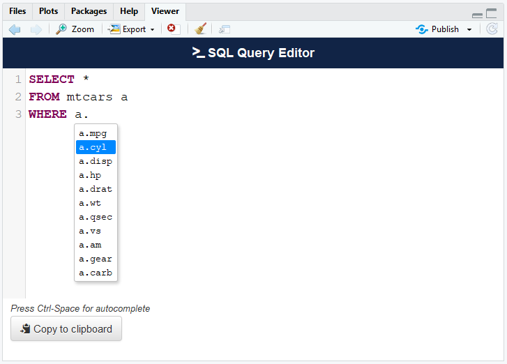
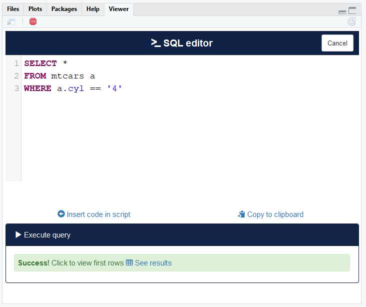

# sqlquery

> SQL query editor

[](https://travis-ci.org/dreamRs/sqlquery)
[](https://www.tidyverse.org/lifecycle/#experimental)


## Overview

Htmlwidget/Shiny gadget to write SQL queries with autocompletion for SQL keywords and for table names and fields.
There are two addins in the package, in both you can write queries, but :

* **Non-interactive mode:** you cannot run queries but you keep control over your R session;
* **Interactive mode:** you can run queries and see first rows of result.
 

## Installation

You can install from Github:

``` r
source("https://install-github.me/dreamRs/sqlquery")
```

## htmlwidget

Basic usage:

``` r
library(sqlquery)
sql_query(value = "SELECT * FROM mtcars")
```

Get autocompletion for tables and fields in a Database:
``` r
library(DBI)
con <- dbConnect(RSQLite::SQLite(), ":memory:")
dbWriteTable(conn = con, name = "mtcars", value = mtcars)

sql_query(conn = con)
```



## shiny app

Basic usage:

``` r
library(sqlquery)
sql_query_app(value = "SELECT * FROM mtcars")
```

With a connection :

``` r
library(DBI)
con <- dbConnect(RSQLite::SQLite(), ":memory:")
dbWriteTable(conn = con, name = "mtcars", value = mtcars)

sql_query_app(conn = con)
```




Click button *see results* to display first rows with RStudio's `View` (if app runs in pane viewer) or in a modal (if app runs in dialog viewer or browser).

To change display mode, use: 
```r
options("sqlquery.display.mode" = "dialog")
```


